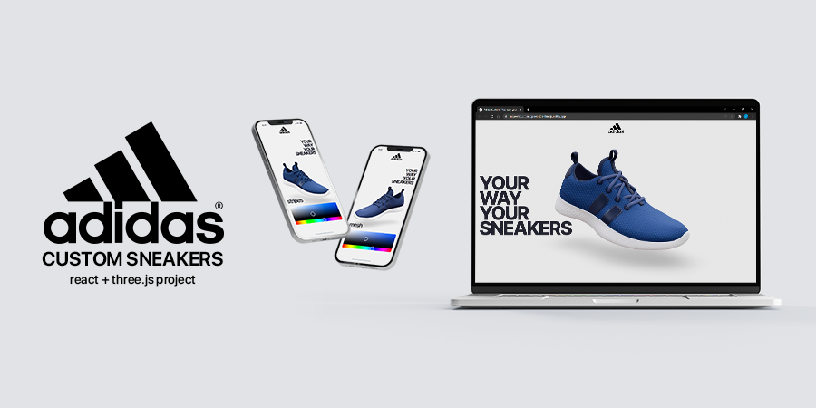

# Adidas Custom Sneakers with React & Three.js

[Live Demo](https://adidascustomsneakers.netlify.app/)

_Disclaimer: This project was done for educational purposes only._

## Stack

- React
- Styled Components
- Three.js
- React Three Fiber
- Drei
- Valtio

## Features

- Choose your favourite colors and create your personalized sneaker.
- Desktop and mobile-ready.

## Getting Started with Create React App

This project was bootstrapped with [Create React App](https://github.com/facebook/create-react-app).

### Available Scripts

In the project directory, you can run:

#### `npm install`

#### `npm start`
