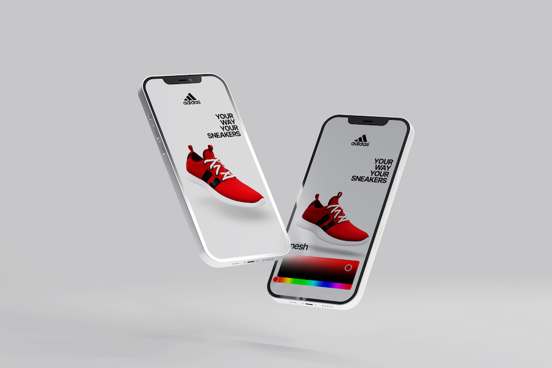

# Adidas Custom Sneakers with React & Three.js

### [Live Demo](https://adidascustomsneakers.netlify.app/)

_Disclaimer: This project was done for educational purposes only._

## Description

This project is an interactive experience built with React and Three.js. 
 
It is part of an educational exercise in which I simulate the case of a brand (in this case Adidas), which requires a web app that allows potential customers to customize their sneakers. 
 
In this MVP I focused on the user being able to customize each part of the shoe easily and simply on a desktop or mobile device.	

## Stack

- React
- Styled Components
- Three.js
- React Three Fiber
- Drei
- Valtio

## Features

- Choose your favourite colors and create your personalized sneaker.
- Desktop and mobile-ready.

___

## Getting Started with Create React App

This project was bootstrapped with [Create React App](https://github.com/facebook/create-react-app).

### Available Scripts

In the project directory, you can run:

#### `npm install`

#### `npm start`
